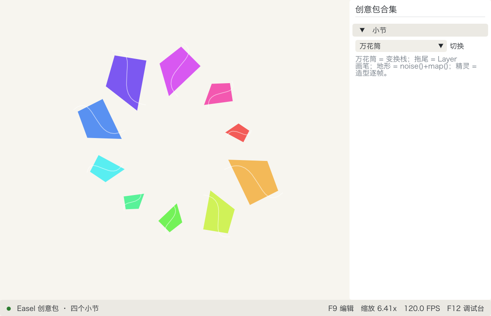
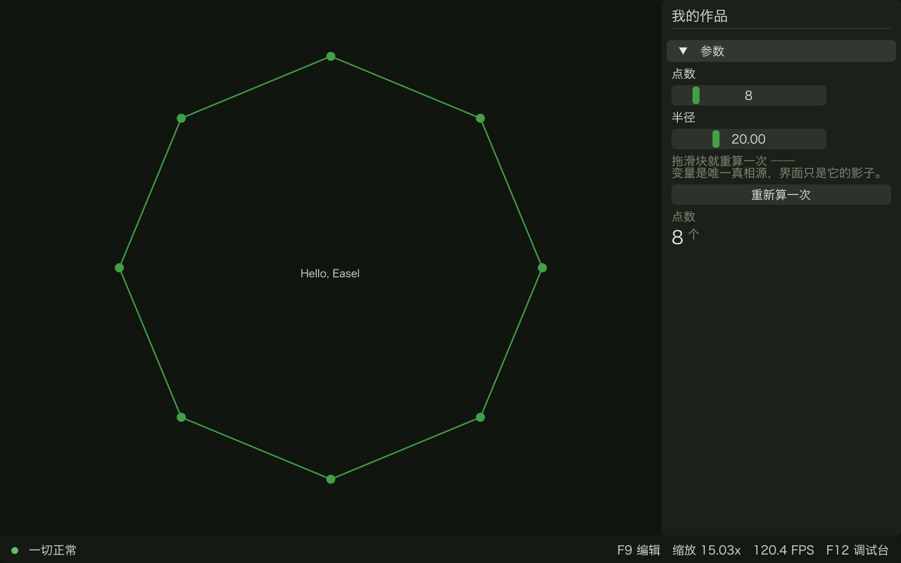
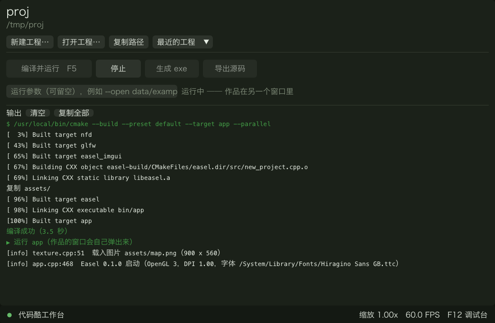
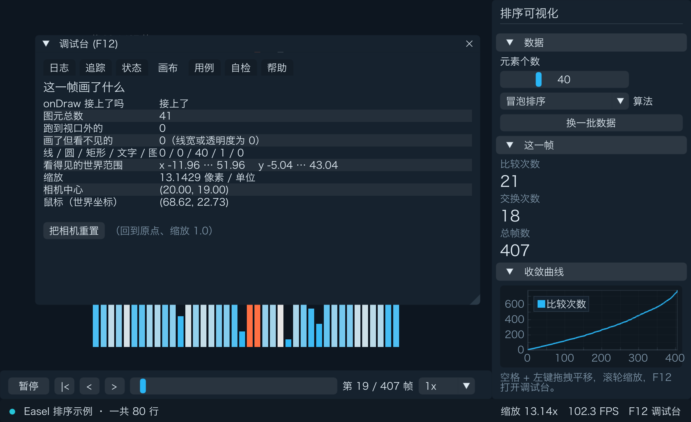

# Easel

[中文](README.zh-CN.md)

*A Processing-style creative coding library for C++, with a built-in debug console and frame-by-frame playback.*



## Highlights

**The debug console is built in.** Press F12 to open it: six pages -- Log, Trace (`EASEL_TRACE` is automatically drawn as a line chart), State (`dbg()` as a live table), Canvas diagnostics (how many primitives are in this frame, how many are off-screen), Export case, and Self-check. A problem seen in the interface can be exported from the "Cases" page into a case file and reproduced from the same seed on the command line.

**Compute once, replay frame by frame.** `Timeline<T>` holds the entire computed sequence, and `App::transport()` attaches a playback bar: play, pause, step, drag the progress, adjust speed.

**The project is self-contained.** "Export source" generates a directory with the source of all dependencies; on a machine with nothing installed and no network access, a single `cmake` command builds the whole interface program.

## What you get

| Category | Contents |
|---|---|
| Canvas | world coordinates, camera zoom and pan, primitives (line / rect / circle / triangle / polygon / bezier / custom shapes), transform stack `push/translate/rotate/scale/pop` |
| Paint layer | `Layer`: draw, stamp, clear -- persists outside of the per-frame redraw |
| Images and sprites | `loadTexture()`, `c.image()`, take one frame out of a sprite sheet with a `Rect` |
| Text | `c.text()`, Chinese fonts are located automatically from the system fonts |
| Panel widgets | slider, toggle, button, stat card, line chart; `#include <imgui.h>` is available at any time |
| Sound | wav / mp3 / flac playback, volume, loudness, spectrum |
| Noise and random | `noise()` / `noiseSeed()`, `rng()`, the run's seed is printed at startup and can be replayed with --seed N |
| Theme | five presets: Forest / Ocean / Ember / Paper / Slate |

## Minimal example

This is the entire content of a blank project's `src/app.cpp` (`Workbench -> New Project -> Skeleton: Blank`):

```cpp
#include <easel/easel.h>
using namespace easel;

int main(int argc, char** argv) {
    App app(argc, argv);
    app.title("MySketch");
    app.onDraw([](Canvas& c) {
        c.text({0, 0}, "Hello, Easel", Align::Center);
    });
    return app.run();
}
```

Running it shows one line of text, "Hello, Easel", centered on an otherwise empty canvas.
For a slightly bigger, interactive example (a ring of draggable-slider points), see
[`examples/hello`](examples/hello) -- also available from the New Project dialog's
"Skeleton" dropdown as "Example: hello".



## Getting started

### macOS

```bash
git clone https://github.com/pfinal/easel.git && cd easel
cmake --preset default && cmake --build --preset default
```

`./build/default/easel` opens the Workbench: "New Project" -> "Build & Run". This requires the Xcode command line tools (`xcode-select --install`) and CMake.

Release package: download the zip, double-click `Easel.app`. Requires the Xcode command line tools and CMake.

### Windows

There is a no-install toolbox containing gcc, cmake, ninja, and Easel, assembled by `scripts/make_toolbox.py`. After extracting it, double-click `easel.bat`. The toolbox's official build ships together with the first release. Requires Windows 7 SP1 x64 or newer (Win10/11 also work); not yet tested on Windows 7. See [`docs/windows-toolbox.md`](docs/windows-toolbox.md) for details, including the OpenGL/DX11 fallback.

## Workbench

New Project / Build & Run / Stop / Build exe / Export source. A project runs as a separate process; clicking an error line jumps to the corresponding location in the source. A blank project has only one file -- `src/app.cpp` -- the build scripts live in `.easel/` and the single-header library isn't copied at all, it's pointed straight at Easel's own `dist/`. The "Skeleton" dropdown can also start from the algorithm skeleton (data file, frame-by-frame replay, convergence chart) or from any bundled example. Project names must be ASCII (compilers don't handle non-ASCII paths well).

Every button has a command-line equivalent (`--build` / `--run` / `--package` / `--export`, alongside the headless `--new`); add `--json` to get a machine-readable result instead of plain text, e.g. `easel --build ~/projects/Demo --json`.



## Debug console

Press F12 to open it: six pages -- Log (level / file:line / frame number / repeat folding), Trace (`EASEL_TRACE` automatically becomes a curve), State (`dbg()` as a live table), Canvas (how many primitives this frame, how many are off-screen, the current world extent), Cases (export a debug case, reproduce command), Self-check (backend / GPU / DPI / fonts / seed / compiler).



## Documentation

- [`docs/reference.md`](docs/reference.md) -- the full API reference (signatures/params/return values), in Chinese.
- [`docs/guide.md`](docs/guide.md) -- usage guide: Scratch / Processing / openFrameworks mapping tables, project structure conventions, design rationale, in Chinese.
- [`docs/cheatsheet.md`](docs/cheatsheet.md) -- a one-page cheat sheet, in Chinese.
- [`examples/`](examples/) -- `hello` (a ring of points with sliders, the smallest interactive example), `sort` (sorting visualization), `creative` (kaleidoscope / trail / noise terrain / sprite animation / sound).

## Building from source

All dependencies are statically linked through `FetchContent`: GLFW 3.4, Dear ImGui v1.92.9b-docking, ImPlot v1.0, nativefiledialog-extended v1.3.0, nlohmann/json v3.12.0, doctest v2.4.12, stb (commit 2c980bb), ImGuiColorTextEdit (commit a20e449), miniaudio 0.11.25.

```bash
python3 scripts/vendor.py       # fetch the nine dependencies into vendor/, fully offline after that
cmake --preset default          # or debug (ASan) / dx11 (Windows DirectX 11 backend)
cmake --build --preset default
ctest --test-dir build/default --output-on-failure -C RelWithDebInfo  # -C required for multi-config generators (MSVC on Windows)
```

## Layout

| Directory | Contents |
|---|---|
| `include/` | public headers: `core.h` (no GUI, zero link dependencies), `app.h`, `canvas.h`, `camera.h`, `timeline.h`, `ui.h`, `audio.h`, `theme.h`, `file.h` |
| `src/` | library implementation |
| `workbench/` | Workbench: new project / build / run / stop / build exe / export source |
| `template/` | algorithm-skeleton starter project (data file, playback, convergence chart) |
| `template-hello/` | blank project template (one file: `src/app.cpp`) |
| `examples/` | the `hello`, `sort`, and `creative` examples |
| `docs/` | reference manual, cheat sheet, screenshots |
| `scripts/` | `vendor.py` (offline dependencies), `make_toolbox.py` (Windows toolbox), `package.py` (release package) |
| `tests/` | unit tests (doctest) |

## License

MIT, see [`LICENSE`](LICENSE). Third-party dependency licenses are included with the release package.

---

Produced by daimaku.net
