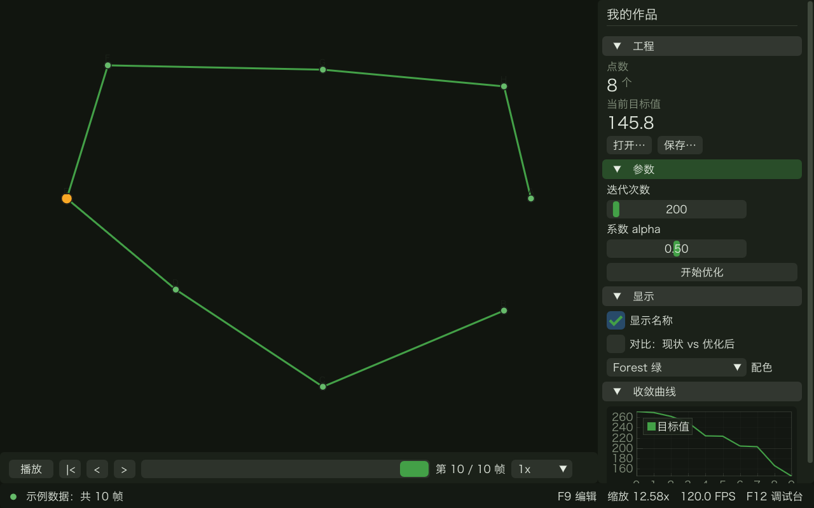

# 我的作品（模板工程）

用 [Easel](https://github.com/pfinal/easel) 做的算法可视化程序。

> **这是模板本身的说明，不是新建工程时生成的那份。**
> 工作台「新建工程」默认出来的是**空白工程**，只有一样东西：`src/app.cpp`（不再生成
> README，D-36）。骨架下拉选「算法骨架」才会多出 `src/solver.cpp` / `data/` / `assets/`。
> 这个目录保留完整布局：它既是新建工程的素材，也是「导出源码」展开时用的标准工程。



（上图就是 `cmake --build` 之后直接跑出来的：示例数据、底图、一条路线、一条收敛曲线、
一个播放条。骨架里的「算法」只是随机换两个点的位置 —— 那部分等着你替换。）

## 从哪儿开始

**双击工作台**（Windows：工具箱里的 `easel.bat`；Mac：`Easel`）。里面有：

| 按钮 | 干什么 |
|---|---|
| 新建工程… | 从模板生成一个新作品，作品名会写进标题 |
| **编译并运行** | 编译 + 把作品跑起来（作品是另一个窗口）。报错行点一下就跳到出错的代码 |
| 停止 | 掐掉正在跑的作品（死循环了就按它） |
| 生成 exe | 优化过的交付版，连同 assets / data 放进 `dist/`，可以直接双击 |
| 导出源码 | 一个自足的完整工程，不装 Easel、不联网也能编 |

你在编辑器里只会看到自己的东西：`src/app.cpp`（界面）、`src/solver.cpp`（算法）、
`tests/`、`data/`、`assets/`。库和构建脚本被折叠起来了（在 `.vscode/settings.json`
的 `files.exclude` 里，想看就把那一段删掉）。

## 三个入口，一份业务代码

```
src/solver.cpp   ← 你唯一写算法的文件
   ├─ 命令行   算法开发的主战场，像普通命令行程序一样
   ├─ 测试     对拍与回归
   └─ 界面     可视化与交付
```

**断点打在 `src/solver.cpp` 上，三个入口都能停下来。**

## 第一次跑

```bash
cmake --preset default
cmake --build --preset default
```

第一次要下载依赖并编译 ImGui，大概几分钟；之后就很快了。

> **现在还要多加一个参数。** `github.com/pfinal/easel` 这个远端仓库还没建好，
> 所以先用本地那份：
>
> ```bash
> cmake --preset default -DEASEL_DIR=../easel     # ../easel 换成你机器上 easel 的路径
> ```
>
> 等仓库推上去之后，这个参数就不用加了（`CMakeLists.txt` 里默认走
> `FetchContent ... GIT_TAG v0.1.0`）。

```bash
./build/default/bin/solver data/example.json                                    # 1. 算法（命令行）
ctest --test-dir build/default --output-on-failure -C RelWithDebInfo            # 2. 测试（-C 是为了支持 Windows MSVC）
./build/default/bin/app --open data/example.json --solve                        # 3. 界面
```

Windows 上把 `./build/default/bin/solver` 换成 `.\build\default\bin\solver.exe`。

## 在小熊猫C++ 里写算法（Windows，前两周推荐）

`src/solver.cpp` 是一个**能自己编译运行的完整程序**，所以不需要 CMake、不需要 Easel 的
任何东西，在小熊猫C++（或 Dev-C++）里直接打开它就行：

1. 打开 `src/solver.cpp`
2. 工具 → 编译器选项 → 编译时加入：`-std=c++17 -DEASEL_STANDALONE`
3. F9 编译、F10 运行、F5 调试

断点、单步、看变量，和普通 C++ 程序一模一样。`src/easel.hpp` 就在旁边，不用管它。

等到要做界面了（`app.cpp`）才需要 CMake —— 那时候再看下面。

## 连 CMake 都不想用的时候

```bash
g++ -std=c++17 -DEASEL_STANDALONE src/solver.cpp -o solver && ./solver data/example.json
```

一条命令，不需要任何库。写算法的头两周你基本只会用这一条。

## VS Code 里按 F5

`.vscode/launch.json` 里有四个配置：

| | |
|---|---|
| **1 · Solver 命令行** | 算法主战场。断点、单步、看变量，和你平时一样 |
| **2 · Tests** | 对拍与回归 |
| **3 · App 图形界面** | 带 `--open data/example.json --solve`，一按 F5 直接看到结果 |
| **4 · Solver 复现一个调试用例** | 把界面里导出的 `debug/case-001.json` 拿到命令行里重跑 |

需要装两个扩展：C/C++、CMake Tools（打开工程时 VS Code 会提示）。

## 兜底：作品自带的编辑栏（F9）

机器上没装 VS Code 的时候用它。程序跑起来按 **F9**，左边开出一栏，`src/solver.cpp`
就在里面，有语法高亮。**它只够改算法**——界面代码请用 VS Code + 工作台。

- **F5** = 保存 + 编译 + 运行**命令行版**的 solver，g++ 的输出落在下半屏。
- 报错那行**可以点**，直接跳到出错的位置；行号旁边的红标记，鼠标停上去看报错原文。
- **Ctrl+S** 保存，**Ctrl+滚轮** 改字号。
- 它不是 IDE：没有断点、没有补全、只开这一个文件。要断点还是用小熊猫C++ 或 VS Code ——
  两边可以同时开着，外面改了文件，编辑栏会问你「读外面的」还是「留我的」，不会偷偷覆盖。

右上角的 **「导出工程…」** 出一个能独立编译的完整工程（见下面「打包交付」）。

## 目录

```
src/solver.cpp        你的算法、数据结构、全局状态 state
src/app.cpp           界面接线（main 就是一份清单，没有算法）
src/easel.hpp      Easel 的单文件核心（自动生成的，别手改）
tests/test_solver.cpp 测试与对拍
data/                 输入数据（JSON）
assets/               底图、字体之类
debug/                调试用例。这就是你的 bug 日志，别删
```

## 出问题了

1. 界面里按 **F12** 打开调试台，六页分别回答：日志 / 追踪 / 状态 / 画布 / 用例 / 自检
2. 状态栏最左边那个点：绿=正常，黄=有警告，红=断言失败或崩溃过
3. `./build/default/bin/app --doctor` 打印环境自检，求助前先跑这个
4. 越界抓不到就用 `cmake --preset debug`（开 ASan + 标准库检查）
5. 详细的看 [Easel 速查表](https://github.com/pfinal/easel/blob/main/docs/cheatsheet.md)

那条闭环：

```
界面里看到不对 → F12 → 用例 → 导出 → 拿到一行命令 → 终端里复现 → 改 → ctest → 回界面
```

## 懒得敲命令

- Windows：双击 `run.bat`（先双击过工具箱里的 `start.bat`）
- Mac / Linux：`./run.sh`

两个脚本都是「没配置就配置，然后编译，然后带示例数据启动 App」。

## 打包交付

**平时自己导（不用装 Python，界面里点一下就行）：**
按 F9 → 「导出工程…」→ 填作品名 → 开始导出。出来的目录是自足的：

```
MySketch/
├─ src/ tests/ data/ assets/ debug/ .vscode/    你的东西
├─ CMakeLists.txt                               会自己发现下面那个 easel/
├─ easel/                                       Easel 源码 + vendor/（编 app 所需的精简版）
├─ licenses/  BUILD.txt  CHECK.txt
```

拿到这份源码的机器**不用装 Easel、不用联网、不用加任何 cmake 参数**：

```bash
g++ -std=c++17 -DEASEL_STANDALONE src/solver.cpp -o solver   # 只要算法
cmake -S . -B build && cmake --build build                   # 连界面一起
```

`CHECK.txt` 会逐条列出核对结果，导出时还真的编了一次 `solver.cpp` 来验证。
命令行等价物：`app --export ../dist/MySketch --name MySketch`。

**正式发布那一次（要 Python，多出 exe 和 zip）：**

```bash
python3 ../easel/scripts/package.py . --name MySketch
```

在 `dist/` 下产出四样：

| | |
|---|---|
| `MySketch-release/` + `.zip` | Release 的 exe + assets + data + README.txt + licenses |
| `MySketch-源码.zip` | 源码，自动排掉 `build/`，含 Easel 与依赖（拿到这份源码的人能重新编译） |
| `检查清单.txt` | 打包时自动生成的核对结果 |

**要在哪个系统上运行，就在哪个系统上打包**——在哪台机器上打包，就出哪台机器的 exe。

---

界面基础库 Easel v0.1（代码酷 daimaku.net 开源发布，MIT）。
